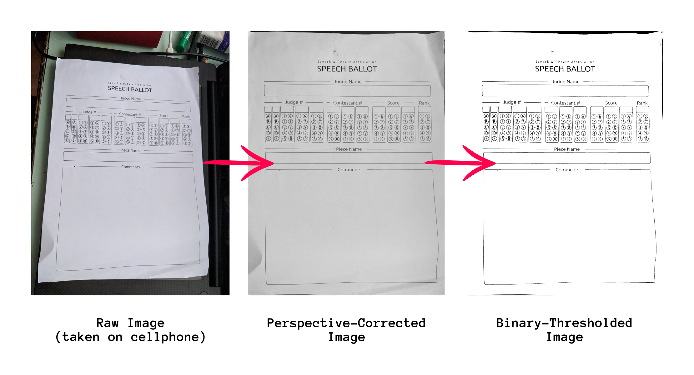

# pyimgscan: open-source document scanning tool 

### Take a picture with your phone and convert it to a professional-looking scan.

<p align="center"></p>

### * Usage
**`$ python3.7 ./pyimgscan.py`**
```
usage: pyimgscan.py [-h] -i IMAGE [-I [INVERTED]]
```
The program will by default output a `corrected.png` and a `thresholded.png`
* `-h` display the above help message
* `-i` specify a path to the source image file
* `-I` also output an inverted binary image (white on black) to `thresholded_inverted.png`

<br>

### * Dependencies

```
numpy==1.16.2
opencv-contrib-python==4.0.0.21
```
can also be found at `requirements.txt`

<br>

### * Setup with `virtualenv`
**1. Set up virtual environment:**   
```
virtualenv -p python3.7 PyImgScan/
cd ./PyImgScan/
./bin/activate
```

**2. Clone repository:**   

   
`git clone https://gitlab.com/sammdu/pyimgscan.git`    

   
`git clone https://github.com/sammdu/pyimgscan.git`

**3. Install dependencies:**   
```
cd pyimgscan/
pip install -r requirements.txt
```

**4. Test out an example!**   
```
python ./pyimgscan.py -i ./test/1.png
```
Available examples: `./test/1.png` `./test/2.jpg` `./test/3.jpg`

<br>

### * TODO
* unify average brightness for better adaptation to different lighting of input images
* instead of convex hull, try to always complete a 4-corner-polygon
* try Gaussian thresholding for better binary image results   
  https://docs.opencv.org/3.4.0/d7/d4d/tutorial_py_thresholding.html   
* add shadow removal functionality   
  https://stackoverflow.com/questions/44047819/increase-image-brightness-without-overflow/44054699#44054699   
  https://stackoverflow.com/questions/44752240/how-to-remove-shadow-from-scanned-images-using-opencv   
* add a border / four anchor points for better positioning and more reliable contour recognition
* build binaries with PyInstaller
* support multi-color thresholding

<br>

* * *
### References:

`imutils` https://github.com/jrosebr1/imutils

`PyImageSearch` https://www.pyimagesearch.com/2014/09/01/build-kick-ass-mobile-document-scanner-just-5-minutes/
